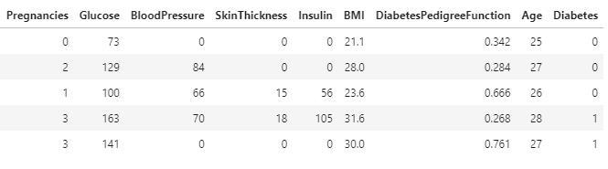

# 4주차 당뇨병 예측하기

주어진 데이터를 사용하여 당뇨병 여부를 예측하는 문제입니다. NN선형 분류로 문제를 해결하세요.

( 당뇨병일 경우 : 1 / 당뇨병이 아닐 경우 : 0 )

## Loss 함수 (Hint)
베이스라인에서는 Loss 함수로 아래 첨부한 코드와 같이 파이토치에서 제공하는 BCELoss 를 사용하였습니다.
(torch.nn.BCELoss 에 대한 Documents)
실습에서 아래 코드를 활용하시기 바랍니다.

이와 관련한 질문이 있으시다면, 조교에게 슬랙 혹은 이메일로 문의주시기 바랍니다.

    loss = torch.nn.BCELoss()

    ## 중간 생략 

    cost = loss(hypothesis, y_train.unsqueeze(1))

## 데이터 예시
아래 데이터 예시를 통해 주어진 데이터를 확인할 수 있습니다.

| columns | 열정보 |
|:---:|:---:|
| Pregnancies | 임신 횟수 |
| Glucose | 글루코오스(탄수화물 화합물) |
| BloodPressure | 혈압 |
| SkinThickness | 피부 두께 |
| Insulin | 인슐린 수치 |
| BMI | BMI 지수 |
| DiabetesPedigreeFunction | 가족력 |
| Age | 나이 |
| Diabetes | 당뇨병일 경우 1 / 당뇨병이 아닐 경우 0 |

# 4주차 재배환경 별 작물 종류 예측하기
본 과제는 토양 유기물과 지역의 기상 데이터가 주어질때, 해당 지역에서 생산 가능한 작물의 종류를 예측하는 문제 입니다. 본 과제는 선형분류 수업을 기반으로 베이스라인을 넘기면 됩니다.

## 데이터의 예시

| columns | 열정보 |
|--|--|
N | 토양 내 질소 함량 비율
P | 토양 내 인산 함량 비율
K | 토양 내 칼륨 함량 비율
temperature | 섭씨 온도
humidity | 상대 습도(%)
ph | 토양의 ph 값
rainfall | 강우량 (mm)

## Evaluation

평가 데이터 550 개에 대하여 총 22개의 작물 중 하나로 분류합니다. 제출된 평가 데이터의 예측값은 **Categorical Accuracy**로 평가 됩니다. 분류 결과는 string 형식으로 다음의 22개의 레이블 중 하나로 예측합니다.
 - mothbeans - lentil - pigeonpeas - cotton - coconut - mungbean - jute - chickpea - mango - apple - blackgram - muskmelon - papaya - coffee - orange - pomegranate - kidneybeans - rice - banana - watermelon - maize - grapes