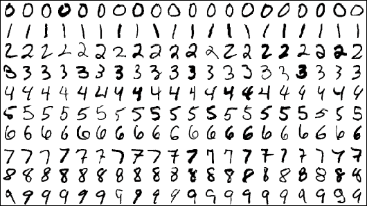

# 5주차 선형분류를 이용한 MNIST 손글씨 분류

## MNIST example

본 데이터셋은 인공지능의 대표적인 손글씨 이미지 데이터셋인 MNIST입니다.
MNIST를 구성하는 숫자는 0~9까지 총 10개의 클래스로 구성됩니다. (상단 이미지 참고)

## 제출 시 주의사항
label을 int형으로 변환하여 제출하시기 바랍니다.

## 목표
선형분류를 사용하여 MNIST 데이터의 숫자를 분류합니다.

## Evaluation
손글씨(0-9 사이의 정수)를 예측하는 분류 문제로, Accuracy(정확도) Score로 평가